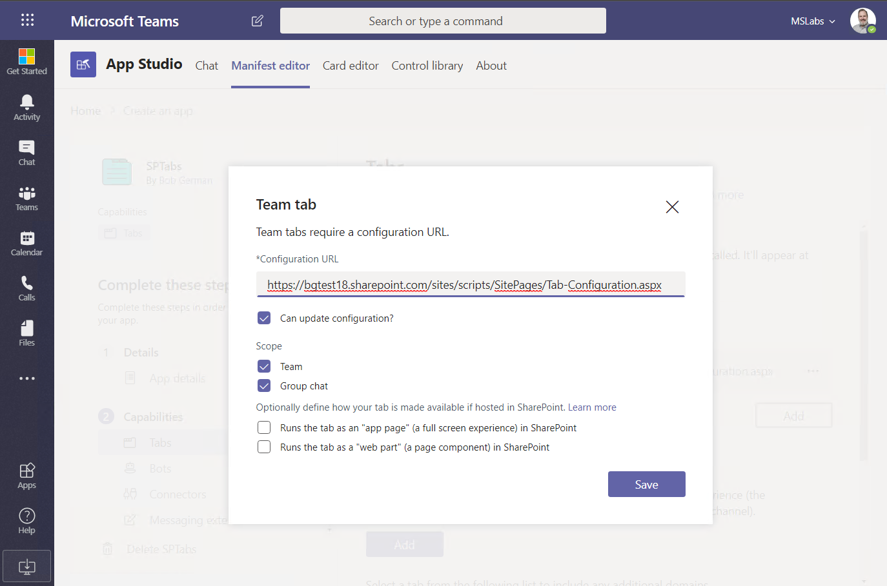

# Teams Configuration Tab

This web part makes a modern SharePoint page into a Teams tab configuration page for use in a Teams application. This allows low-code developers to create Teams applications containing configurable tabs without the need to code a custom configuration page. Using this tool, along with Microsoft Teams App Studio, low-code developers can build Teams applications entirely from modern SharePoint pages.

Microsoft Teams applications support _configurable tabs_  that work in Teams channels and group chat conversations. Configurable tabs require a configuation page that is presented to users when they add a tab. This web part implements a simple configuration experience.

When the user selects one of the tab options, the tab is saved pointing to the corresponding SharePoint page.

## Compatibility

| :warning: Important          |
|:---------------------------|
| Every SPFx version is only compatible with specific version(s) of Node.js. In order to be able to build this sample, please ensure that the version of Node on your workstation matches one of the versions listed in this section. This sample will not work on a different version of Node.|
|Refer to <https://aka.ms/spfx-matrix> for more information on SPFx compatibility.   |

 
 

-Incompatible-red.svg "SharePoint Server 2016 Feature Pack 2 requires SPFx 1.1")

## Applies to

* [SharePoint Framework Developer](https://learn.microsoft.com/sharepoint/dev/spfx/sharepoint-framework-overview)
* [Office 365 developer tenant](https://learn.microsoft.com/sharepoint/dev/spfx/set-up-your-developer-tenant)

## Contributors

* [Bob German](https://github.com/BobGerman) ([@Bob1German](http://www.twitter.com/Bob1German))

## Version history

Version|Date|Comments
-------|----|--------
1.0|January 6, 2020|Initial release

## Minimal Path to Awesome

#### 1. Build the web part

>  This sample can also be opened with [VS Code Remote Development](https://code.visualstudio.com/docs/remote/remote-overview). Visit https://aka.ms/spfx-devcontainer for further instructions.

Build and package the web part

 * npm install
 * gulp bundle --ship
 * gulp package-solution --ship

Install into your SharePoint app catalog and add it to a SharePoint site.

#### 2. Create a configuration page

Create a new modern SharePoint page that will become the tab configuration page, and add the Configure Tab web part. Edit the web part to set up the tab information.

Your configuration page will present users with one or more choices for tabs they'd like to show. Enter a line for each choice into the edior panel:

(1) Enter a name for each tab, each on its own line
(2) Enter a unique entity ID for each tab, each on its own line corresponding to the lines in (1)
(3) Enter the URL for each tab, again each on its own line

If you want all tab clicks to be redirected back through this page, select the Redirect checkbox. This allows you to change the URL's for tabs even after they've been configured, however users may notice the page flickering as they are redirected.

#### 3. Set up the app manifest

Create a new app manifest in [Teams App Studio](https://learn.microsoft.com/microsoftteams/platform/concepts/build-and-test/app-studio-overview), and add a Team Tab. Paste the URL of your configuration page into the Configuration URL field.

If you want users to be able to edit the tab and return to the configuration page (and maybe switch to another choice), then check the Can update configuration checkbox. You can also decide if your app is available in Teams, Group Chats, or both.

#### 4. Deploy

Now check to be sure the valid domains are set up (as above) and install the app into a Teams channel or Group Chat. You will be presentd with the configuration page.

If you only configured one choice, just click the Save button and save your tab. If you configured multiple choices, pick one and the save button will light up and allow you to save the tab.

Now your page is visible within the new tab for all to see.

#### 5. Maintain

If you set the web part up to redirect tab clicks, it saved its own URL and the entity ID into Teams for each tab. The web part will look at the entity ID and redirect to the target page. Thus it is possible to edit the web part and change the URLs, and thus change all the tabs that had previously been created.

If you edit the web part and remove the choice (entity ID), it will prompt the user to edit the tab and make another selection.

## Help

We do not support samples, but this community is always willing to help, and we want to improve these samples. We use GitHub to track issues, which makes it easy for  community members to volunteer their time and help resolve issues.

If you're having issues building the solution, please run [spfx doctor](https://pnp.github.io/cli-microsoft365/cmd/spfx/spfx-doctor/) from within the solution folder to diagnose incompatibility issues with your environment.

You can try looking at [issues related to this sample](https://github.com/pnp/sp-dev-fx-webparts/issues?q=label%3A%22sample%3A%20react-teams-configure-tab%22) to see if anybody else is having the same issues.

You can also try looking at [discussions related to this sample](https://github.com/pnp/sp-dev-fx-webparts/discussions?discussions_q=react-teams-configure-tab) and see what the community is saying.

If you encounter any issues while using this sample, [create a new issue](https://github.com/pnp/sp-dev-fx-webparts/issues/new?assignees=&labels=Needs%3A+Triage+%3Amag%3A%2Ctype%3Abug-suspected%2Csample%3A%20react-teams-configure-tab&template=bug-report.yml&sample=react-teams-configure-tab&authors=@BobGerman&title=react-teams-configure-tab%20-%20).

For questions regarding this sample, [create a new question](https://github.com/pnp/sp-dev-fx-webparts/issues/new?assignees=&labels=Needs%3A+Triage+%3Amag%3A%2Ctype%3Aquestion%2Csample%3A%20react-teams-configure-tab&template=question.yml&sample=react-teams-configure-tab&authors=@BobGerman&title=react-teams-configure-tab%20-%20).

Finally, if you have an idea for improvement, [make a suggestion](https://github.com/pnp/sp-dev-fx-webparts/issues/new?assignees=&labels=Needs%3A+Triage+%3Amag%3A%2Ctype%3Aenhancement%2Csample%3A%20react-teams-configure-tab&template=suggestion.yml&sample=react-teams-configure-tab&authors=@BobGerman&title=react-teams-configure-tab%20-%20).

## Disclaimer

**THIS CODE IS PROVIDED *AS IS* WITHOUT WARRANTY OF ANY KIND, EITHER EXPRESS OR IMPLIED, INCLUDING ANY IMPLIED WARRANTIES OF FITNESS FOR A PARTICULAR PURPOSE, MERCHANTABILITY, OR NON-INFRINGEMENT.**

